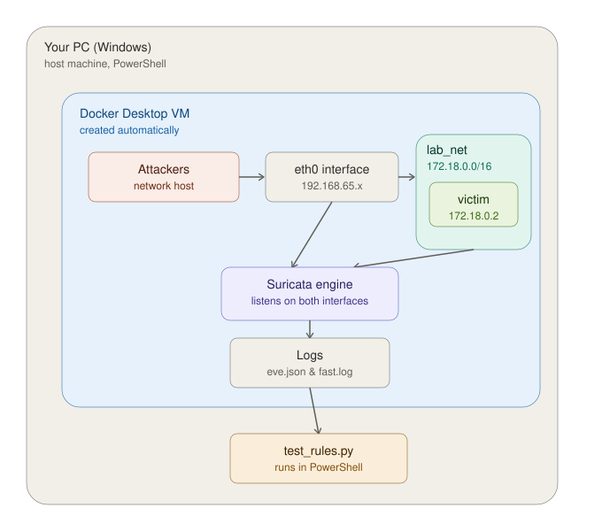

# 🛡️ Suricata IDS: Rule Tuning & Noise Reduction Lab

   

A hands-on Network Intrusion Detection System (NIDS) lab focused on designing custom Suricata detection signatures, analyzing raw telemetry, and applying Alert Tuning techniques to eliminate false positives and alert fatigue without sacrificing security coverage.

---

## 📌 Executive summary

A high volume of noise and poorly tuned signatures in an IDS causes alert fatigue, masking real security events inside a SOC.

This project simulates a controlled, containerized environment where network attack vectors (ICMP discovery, TCP SYN scanning, and SQL injection against a web application) are launched against custom signatures. Through iterative refinement — volume-based thresholds, bidirectional flow filtering, and specific ICMP types — log volume was reduced from redundant multi-packet streams to exact, high-fidelity alerts, **validated automatically against real evidence, not just manual inspection**.

---

## 🏗️ Overview


## 🏗️ Architecture & components

The lab runs in an isolated Docker environment, on a native Windows host with Docker Desktop.



### ⚠️ Critical architecture note: `network_mode: host` on Docker Desktop

On Docker Desktop (Windows/Mac), `network_mode: host` does **not** bind the container to your computer's physical network interface. Docker Desktop runs an internal **Linux virtual machine** underneath (LinuxKit/WSL2), and `host` binds to *that VM's* network namespace, not to Windows' physical network adapter.

**Practical consequence:** Suricata in this environment only inspects traffic generated *inside the Docker Desktop VM* — including traffic from the attacker containers used in testing — not traffic native to the host operating system. On a native Linux deployment, `network_mode: host` would expose the machine's actual physical interface.

### Component stack

| Component | Role |
|---|---|
| **Detection engine** | Suricata 7.0.6 (`jasonish/suricata` image), running as a native Docker container |
| **Orchestration** | `docker-compose.yml`, with volume mounts for rules, config, and logs |
| **Victim container** | `nginx:alpine` on the `lab_net` network, an isolated, self-owned target (see rationale below) |
| **Test automation** | Python script (`test_rules.py`) that generates attack traffic and **automatically verifies** against `eve.json` that the expected alert was generated |
| **Log inspection** | PowerShell (`Get-Content -Wait`) for live monitoring; `eve.json` for structured analysis |

### Why a self-owned victim container

Earlier versions of this lab sent test traffic against `1.1.1.1` (Cloudflare) and `example.com` (IANA) — real third-party infrastructure. This was corrected for three reasons:

1. **Reproducibility** — not depending on an external service responding consistently, or on internet connectivity, to run the tests.
2. **Determinism** — a self-owned target enables consistent regression testing.
3. **Professional and ethical hygiene** — sending scan traffic or attack payloads against infrastructure you don't own, even trivially, contradicts this project's own authorization disclaimer (see License section).

---

## 📝 Signature engineering (`rules/local.rules`)

The signature set covers three distinct detection layers, with MITRE ATT&CK metadata and known false-positive notes documented directly in each rule.

```
# 1. ICMP Network Discovery Detection — MITRE T1595
alert icmp any any -> any any (msg:"[IDS ALERT] ICMP Network Discovery Detected"; itype:8; threshold: type limit, track by_src, count 1, seconds 30; classtype:attempted-recon; reference:url,attack.mitre.org/techniques/T1595; sid:1000001; rev:5;)

# 2. TCP SYN Port Scan Detection — MITRE T1046
alert tcp any any -> any !2376 (msg:"[IDS ALERT] Possible TCP SYN Port Scan"; flow:to_server; flags:S,12; threshold: type threshold, track by_src, count 15, seconds 5; classtype:network-scan; reference:url,attack.mitre.org/techniques/T1046; sid:1000002; rev:6;)

# 3. SQL Injection — UNION SELECT — MITRE T1190
alert http any any -> any any (msg:"[IDS ALERT] SQL Injection Attempt - UNION SELECT"; flow:to_server,established; http.uri; content:"UNION"; nocase; content:"SELECT"; nocase; distance:0; threshold: type threshold, track by_src, count 1, seconds 10; classtype:web-application-attack; reference:url,owasp.org/www-community/attacks/SQL_Injection; sid:1000003; rev:3;)

# 4. SQL Injection — Tautology Bypass
alert http any any -> any any (msg:"[IDS ALERT] SQL Injection Attempt - Tautology Bypass"; ... sid:1000004; rev:1;)

# 5. SQL Injection — Time-based Blind
alert http any any -> any any (msg:"[IDS ALERT] SQL Injection Attempt - Time-based Blind"; ... sid:1000005; rev:1;)
```

---

## ⚡ Tuning methodology & noise reduction

| SID | Target event | Initial issue | Applied strategy | Result |
|---|---|---|---|---|
| 1000001 | ICMP ping | Triggered twice per ping (Request + Reply) | `itype:8` isolates outbound requests | Single alert per ping sequence |
| 1000002 | SYN scan | **Triggered on any normal TCP connection** (e.g. legitimate HTTPS traffic) — `type limit, count 1` requires no real volume | `type threshold, count 15, seconds 5` — requires genuine scan-like behavior, not a single SYN | False positive eliminated; the engine now requires connection volume, not just presence |
| 1000003 | SQL Injection (UNION) | Single-word signature ("UNION") — false positives against legitimate text; threshold was dropped in an intermediate iteration | Dual `content` match (UNION + SELECT with `distance:0`) + threshold restored | More specific signature, no duplicates from automated attack tools |
| 1000004 / 1000005 | SQLi tautology / time-based blind | Not detected by the original signature | New, independent signatures with their own SIDs | Expanded SQLi vector coverage |

### On `type limit` vs `type threshold`

A key design insight discovered during tuning: **`type limit` is not behavior-based detection, it's only noise suppression** — it fires on the first matching event and then goes silent. `type threshold` requires a minimum volume of events to accumulate before alerting, which is what actually distinguishes normal traffic from malicious behavior (like a real scan). Rule 1000002 originally used `type limit`, which made it fire on any normal outbound TCP connection — corrected to `type threshold`.

---

## 🧪 Automated validation

### Test suite (`test_rules.py`)

Unlike an earlier version that only confirmed the attack command executed, the current suite **automatically verifies against `eve.json`** that the expected `signature_id` was generated — or, for benign traffic, that it correctly was **not** generated.

```powershell
python test_rules.py
```

5 test cases:

| # | Case | Type | Expected SID |
|---|---|---|---|
| 1 | ICMP ping | Positive | 1000001 |
| 2 | Real SYN scan (nmap, 100 ports) | Positive | 1000002 |
| 3 | Single benign TCP connection | **Negative** (must not alert) | 1000002 |
| 4 | SQLi UNION SELECT | Positive | 1000003 |
| 5 | SQLi time-based blind | Positive | 1000005 |

```
============================================================
 TEST SUMMARY
============================================================
  5/5 tests passed
  ✅ ALL TESTS PASSED
```

Case 3 (negative) is just as important as the positive cases: it confirms the corrected rules do **not** generate false positives against normal traffic — closing the original problem that motivated this project.

### Syntax validation

Before deploying, validate that the rules and configuration load without errors:

```powershell
docker run --rm -v ${PWD}/rules:/rules -v ${PWD}/config/suricata.yaml:/etc/suricata/suricata.yaml `
  jasonish/suricata:7.0.6 suricata -T -S /rules/local.rules -c /etc/suricata/suricata.yaml
```

---

## 🐛 Troubleshooting — real findings during deployment

Documented because anyone reproducing this lab on Docker Desktop will most likely run into the same issues.

### 1. Suricata generates no alerts for traffic toward the victim container

**Symptom:** attack traffic successfully reaches the victim container (confirmed via successful `curl`/`ping`/`nmap`), but `eve.json` never logs the expected alert.

**Cause:** Suricata, configured with a single `af-packet` interface (`eth0`), only sees traffic entering/exiting the VM toward the outside world. Traffic between containers on `network_mode: host` and containers on a separate bridge network (like `victim` on `lab_net`) travels over a *different* network interface — the Docker bridge — which never passes through `eth0`.

**Fix:** add a second `af-packet` entry in `suricata.yaml` pointing to the bridge interface name (found via `docker exec suricata_ids ip a`), and start Suricata with the `--af-packet` flag (no value) instead of `-i <interface>`, so it picks up the full interface list from the `.yaml` instead of overriding it with a single one.

### 2. The bridge interface name changes between restarts

**Symptom:** an `af-packet` configuration that worked stops working after a `docker compose down` + `up`, with the error `failed to find interface: No such device`.

**Cause:** the Docker bridge's technical name (`br-xxxxxxxxxxxx`) is derived from the network's internal ID, which changes every time the network is destroyed and recreated — which happens with `docker compose down`.

**Practical fix:** use `docker compose stop` / `start` instead of `down` / `up` during normal development, since they don't destroy the network. If `down` is used, re-check the current name with `docker exec suricata_ids ip a` before restarting.

### 3. The container enters a restart loop (`chown: Read-only file system`)

**Cause:** the `jasonish/suricata` image's entrypoint tries to adjust permissions (`chown`) on files mounted at `/etc/suricata` and `/var/lib/suricata/rules`. If those volumes are mounted read-only (`:ro`), the `chown` fails and the boot process crashes — restarting indefinitely under `restart: unless-stopped`.

**Fix:** mount those volumes without the `:ro` flag for this specific image.

### 4. The test harness reports false positives that aren't real

**Symptom:** a negative test case (benign traffic that shouldn't alert) reports that the alert *did* fire — even though manual inspection shows that alert belongs to a previous test.

**Cause:** the verification function re-read the entirety of `eve.json` from the start on every call, without filtering by time. Since it's an append-only log, alerts from previous tests kept being "found" in later checks.

**Fix:** each test marks its own start timestamp (`datetime.now(UTC)`) and only counts alerts with a timestamp after that point.

### 5. Commands with single quotes fail on Windows (`curl exit status 3`)

**Cause:** `subprocess.run(..., shell=True)` invokes `cmd.exe` on Windows, which does not interpret single quotes (`'...'`) as a string delimiter, unlike `bash` on Linux/Mac. URLs ended up malformed by the time they reached the container.

**Fix:** use double quotes in commands run via `shell=True` when the script needs to run on Windows.

---

## 🗂️ Repository structure

```
suricata-ids-rule-tuning/
├── docker-compose.yml         # orchestration: suricata + victim, pinned image, healthcheck
├── config/
│   └── suricata.yaml          # versioned config: eve.json, HOME_NET, dual af-packet interface
├── rules/
│   └── local.rules            # 5 tuned signatures + MITRE ATT&CK references
├── logs/
│   └── (generated at runtime, excluded from git)
├── test_rules.py                # test suite with real verification against eve.json
└── README.md
```

### Note on `logs/`

Excluded from version control via `.gitignore`. `fast.log` and `eve.json` are generated dynamically at runtime — excluding them prevents polluting Git history, avoids merge conflicts, and prevents exposing operational telemetry in a public repository.

---

## 🧠 Key technical takeaways

- **SOC efficiency:** a poorly chosen threshold type (`type limit` vs `type threshold`) can turn a behavior-based detection rule into a source of false positives — choosing the right threshold type matters as much as the signature itself.
- **Signature design:** mastery of Snort/Suricata syntax options (`itype`, `flags`, `flow`, `http.uri`, `distance`, `threshold`, `classtype`), and why a single-word signature is insufficient for reliable detection.
- **Container networking:** practical understanding of the difference between `network_mode: host` and bridge networks, and how that determines what traffic is visible to a NIDS — including Docker Desktop's undocumented quirks on Windows/Mac.
- **Security infrastructure testing:** the difference between a script that "executes" test traffic and one that "verifies" results — and why a test harness against append-only logs needs to filter by time, not just by content.

---

## License & legal disclaimer

### License

This project is licensed under the MIT License — see the `LICENSE` file for details. Free to use, modify, and distribute for educational and defensive security purposes.

### Legal & educational disclaimer

**Notice:** this tool is designed exclusively for authorized network auditing and security hardening assessment. Ensure you have explicit authorization before running audit operations against active enterprise infrastructure. All tests in this lab run against a self-owned, isolated container (`victim`), never against third-party infrastructure.
