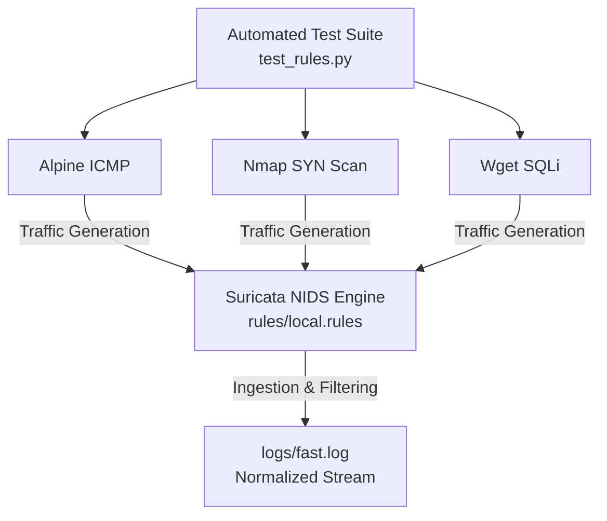

# 🛡️ Suricata IDS: Rule Tuning & Noise Reduction Lab

[](https://suricata.io/)
[](https://www.docker.com/)
[](https://opensource.org/licenses/MIT)
[]()

A hands-on Network Intrusion Detection System (NIDS) lab focused on designing custom Suricata detection rules, analyzing raw telemetry, and applying **Alert Tuning** techniques to eliminate false positives and alert fatigue without compromising security coverage.

---

## 📌 Executive Summary

High volume of noise and unoptimized signatures in Intrusion Detection Systems leads to **alert fatigue**, masking critical security events inside Security Operations Centers (SOC). 

This project simulates a controlled containerized environment where network attack vectors (ICMP discovery, TCP SYN scanning, and Web Application SQL Injection) are launched against custom signatures. Through iterative refinement (utilizing rate-limiting thresholds, bidirectional flow filtering, and specific ICMP types) the log volume was successfully reduced from redundant multi-packet streams to **exact, high-fidelity alerts**.

---

## 🏗️ Architecture & Component Overview

The laboratory operates within a lightweight Docker-isolated environment running on a native Windows host:


### Stack Components:
* **Detection Engine:** Suricata NIDS running as a native Docker container.
* **Orchestration:** `docker-compose` mapping volume mounts for rules and logs.
* **Testing Automation:** Custom Python script (`test_rules.py`) executing controlled `docker run` triggers against network interfaces.
* **Log Inspection:** PowerShell real-time log monitoring (`Get-Content -Wait`).

---

## 📝 Signature Engineering (`rules/local.rules`)

The customized signature set addresses three distinct detection layers, optimized to eliminate chatter:

```snort
# 1. ICMP Network Discovery Detection
# Captures outbound ICMP Echo Requests (Type 8) only, filtering out return replies.
alert icmp any any -> any any (msg:"[IDS ALERT] ICMP Network Discovery Detected"; itype:8; threshold: type limit, track by_src, count 1, seconds 30; classtype:not-suspicious; sid:1000001; rev:4;)

# 2. Nmap SYN Port Scan Detection
# Triggered by rapid SYN flag sequences, ignoring single-packet TCP handshakes from local host interfaces.
alert tcp any any -> any any (msg:"[IDS ALERT] Nmap SYN Port Scan Detected"; flags:S; threshold: type limit, track by_src, count 1, seconds 10; classtype:attempted-recon; sid:1000002; rev:5;)

# 3. SQL Injection Attack Detection
# Detects 'UNION' payloads over HTTP TCP streams, rate-limited to 1 alert per session burst.
alert tcp any any -> any any (msg:"[IDS ALERT] SQL Injection Attempt Detected"; content:"UNION"; nocase; threshold: type limit, track by_src, count 1, seconds 10; classtype:web-application-attack; sid:1000003; rev:10;)
```
## ⚡ Alert Tuning & Noise Reduction Methodology

During initial execution, raw detection rules generated redundant log entries due to multi-packet HTTP TCP payloads, ICMP bidirectional replies, and background interface activity.

| Signature ID | Target Event | Initial Issue | Applied Tuning Strategy | Result |
|---|---|---|---|---|
| SID: 1000001 | ICMP Ping | Triggered twice per ping (Request + Reply). | Added `itype:8` to isolate outbound requests. | Single alert per ping sequence. |
| SID: 1000002 | Nmap SYN Scan | Triggered by normal outbound connections. | Integrated `threshold: type limit, rate control`. | Suppressed interface chatter. |
| SID: 1000003 | SQL Injection | Generated 6+ duplicate logs per single wget request. | Applied `track by_src, count 1, seconds 10`. | Reduced to 1 high-priority alert. |

## 🧪 Validation & Evidence

### 1. Automated Execution Suite

The lab uses `test_rules.py` to trigger all 3 attack vectors sequentially:

```bash
python test_rules.py
```

### 2. High-Fidelity Alert Telemetry

Inspecting `logs/fast.log` demonstrates clean, 1:1 event mapping without duplicate noise:

```
08/02/2026-16:47:52.168565  [**] [1:1000001:3] [IDS ALERT] ICMP Network Discovery Detected [**] [Classification: Not Suspicious Traffic] [Priority: 3] {ICMP} 192.168.65.3:8 -> 1.1.1.1:0
08/02/2026-16:47:56.499920  [**] [1:1000002:4] [IDS ALERT] Nmap SYN Port Scan Detected [**] [Classification: Attempted Information Leak] [Priority: 2] {TCP} 192.168.65.3:63121 -> 1.1.1.1:443
08/02/2026-16:48:02.157684  [**] [1:1000002:4] [IDS ALERT] Nmap SYN Port Scan Detected [**] [Classification: Attempted Information Leak] [Priority: 2] {TCP} fdc4:f303:9324:0000:0000:0000:0000:0003:33732 -> 2606:4700:0010:0000:0000:0000:ac42:93f3:80
08/02/2026-16:48:02.208822  [**] [1:1000003:2] [IDS ALERT] SQL Injection Attempt Detected [**] [Classification: Web Application Attack] [Priority: 1] {TCP} fdc4:f303:9324:0000:0000:0000:0000:0003:33732 -> 2606:4700:0010:0000:0000:0000:ac42:93f3:80
```
The IDS successfully detected SYN-based scanning behavior over both IPv4 and IPv6 traffic, demonstrating dual-stack monitoring capabilities.

## 🗂️ Repository Structure

```
suricata-ids-rule-tuning/
├── docker-compose.yml        # Suricata container orchestration
├── rules/
│   └── local.rules           # Custom tuned Suricata signatures
├── logs/
│   └── fast.log              # NIDS alert log output
├── test_rules.py             # Automated attack simulation script
└── README.md                 # Project documentation
```
> ⚠️ **Architecture Note (`logs/` Directory):**  
> The `logs/` directory is intentionally excluded from version control via `.gitignore`. Log files (`fast.log` and `eve.json`) are dynamically generated at runtime by Suricata. Excluding them prevents Git history pollution, avoids merge conflicts, and adheres to security best practices by preventing sensitive network operational telemetry from being exposed in the public repository.

## 🧠 Key Technical Takeaways

- **SOC Efficiency:** Mitigated log bloat, proving how proper thresholding directly improves SIEM ingestion costs and analyst response speed.
- **Signature Design:** Mastered Snort/Suricata syntax options (`itype`, `flags`, `nocase`, `classtype`, `threshold`).
- **Container Security:** Managed Docker network isolation and host volume bindings for live telemetry analysis.

## License & Legal Disclaimer

### License
This project is licensed under the MIT License - see the [LICENSE](LICENSE) file for details. You are free to use, modify, and distribute this material for educational and defensive security purposes.

### Legal & Educational Disclaimer
> **Notice:** This tool is designed for authorized network auditing and security hardening assessment purposes only. Ensure you have explicit authorization before running audit operations against active enterprise infrastructure.
